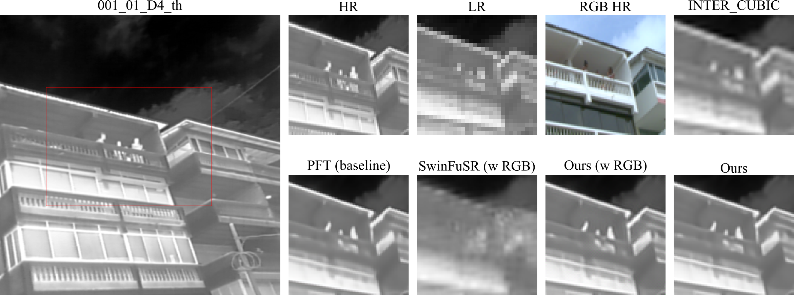
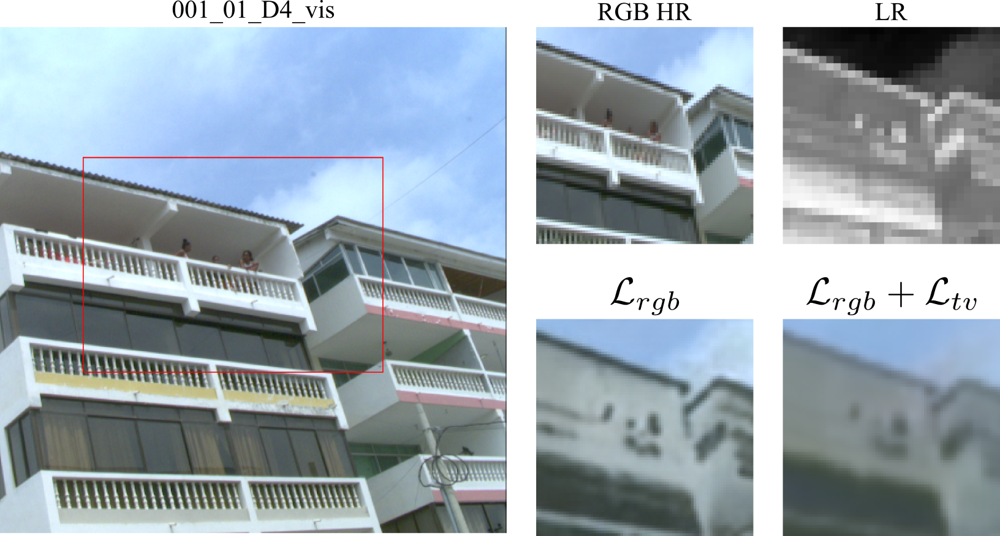

<div align="center">

# Thermal Single Image Super-Resolution

[](static/paper.pdf)
[](https://drive.google.com/drive/folders/1ChkxVDghFWUtJydJKLp5yssrUfm0VWfg?usp=sharing)

[Guillermo Pinto](https://guillepinto.github.io/), [Andrea Parra](https://github.com/andpgate), Nicolás Ramírez.

> **Abstract:** Thermal Image Super-Resolution (TISR) is crucial to enhance imagery from low-cost infrared sensors, however, its low resolution, weak contrast, and noise present significant challenges for traditional methods. In this work, we adapt the Progressive Focused Transformer (PFT), originally trained in visible-spectrum data, by fine-tuning with thermal-RGB pairs. We introduce a cross-channel loss to transfer RGB textures and a total variation (TV) loss to preserve the characteristic smoothness of thermal images. Using the CIDIS dataset, our method achieves 32,0 dB PSNR and 0,904 SSIM, outperforming bicubic interpolation and SwinFuSR. Ablation studies show that the two losses are complementary, and we observe an emergent colorizing property of thermal images when the cross channel loss is used in isolation. This results demonstrated that leveraging Transformers designed for the visible spectrum provides an effective and computationally lightweight solution TISR.
>
>  
>  
</div>

This repository is a fork of the implementation of the paper "Progressive Focused Transformer for Single Image Super-Resolution", CVPR, 2025. Here we adapted the code to:

1. Fine-tune the model for thermal images.
2. Implement a cross-channel loss to supervise training with RGB images inspired by "ThermalNeRF: Thermal Radiance Fields", ICCP, 2024.

## Contents
1. [Enviroment](#environment)
1. [Inference](#inference)
1. [Training](#training)
1. [Testing](#testing)
1. [Results](#results)
1. [Visual Results](#visual-results)
1. [Visualization of Attention Distributions](#visualization-of-attention-distributions)
1. [Acknowledgements](#acknowledgements)
1. [Citation](#citation)

## Environment
- Python 3.9
- PyTorch 2.5.0

### Installation
```bash
git clone https://github.com/guillepinto/PFT-SR.git

conda create -n PFT python=3.9
conda activate PFT

pip install -r requirements.txt && python setup.py develop

cd ./ops_smm && ./make.sh && cd ..
```
### TODO: explain here the additional steps to get ready to make inference. Also, you have to test it by yourself.

## Inference
Using ```inference.py``` for fast inference on single image or multiple images within the same folder.
```bash
# For lightweight SR
python inference.py -i inference_image.png -o results/test/ --scale 4 --task lightweight
python inference.py -i inference_images/ -o results/test/ --scale 4 --task lightweight
```
The PFT SR model processes the image ```inference_image.png``` or images within the ```inference_images/``` directory. The results will be saved in the ```results/inference/``` directory.


## Training
### Data Preparation
- Download the training dataset [CIDIS](https://github.com/vision-cidis/CIDIS-dataset) and put it in the folder `./datasets`.

### TODO: here you have to explain the process on how to get the training dataset (downscaling process and specific commands)

### Training Commands
- Refer to the training configuration files in `./options/train` folder for detailed settings.

- PFT-light (Lightweight Image Super-Resolution)
```bash
# batch size = 1 (GPUs) × 4 (per GPU)
# training dataset: CIDIS

# ×3 PFT finetune, input size = 64×64, 50k iterations
CUDA_VISIBLE_DEVICES=0 python -m torch.distributed.launch --use-env --nproc_per_node=1 --master_port=1145  basicsr/train.py -opt options/train/102_PFT_light_SRx3_finetune_thermal.yml --launcher pytorch

# ×3 PFT finetune with cross-channel and TV, input size = 64×64, 50k iterations
CUDA_VISIBLE_DEVICES=0 python -m torch.distributed.launch --use-env --nproc_per_node=1 --master_port=1145  basicsr/train.py -opt options/train/102_PFT_light_SRx3_finetune_thermal_rgb_l1_tv.yml --launcher pytorch
```
You can also run the other experiments by just updating the configuration on the `-opt` parameter.
Note: We trained on Lightning AI x1 T4 GPU. Because of this computational constraint we only did experiments with the light version of the model.


## Testing
### Data Preparation
- Download the testing data (Set5 + Set14 + BSD100 + Urban100 + Manga109 [[download](https://drive.google.com/file/d/1_4Fy9emAcqdiBwVM6FvbJU50LCtaBoMt/view?usp=sharing)]) and put them in the folder `./datasets`.

### Pretrained Models
- Download the [pretrained models](https://drive.google.com/drive/folders/1ChkxVDghFWUtJydJKLp5yssrUfm0VWfg?usp=sharing) and put them in the folder `./experiments/pretrained_models`.

### TODO: Upload the models to drive or somewher so people can use them. I think Hugging Face is a good option for us.

### Testing Commands
- Refer to the testing configuration files in `./options/test` folder for detailed settings.
- PFT-light (Lightweight Image Super-Resolution)
```bash
python basicsr/test.py -opt options/test/101_PFT_light_SRx2_scratch.yml
python basicsr/test.py -opt options/test/102_PFT_light_SRx3_finetune_thermal_rgb_l1.yml

```
### TODO: Upload the options for testing from the studio in Lightning AI. To do this you before have to:
- Change the name of the trained models to a semantically correct ones
- Move them to the pretrained_models folder
- Change the `pretrain_network_g` parameter in the testing options

## Results

- Lightweight Image Super-Resolution

| Method                | Scale | PSNR ↑    | SSIM ↑   |
|-----------------------|:-----:|----------:|---------:|
| INTER_CUBIC           |       | 27.7669   | 0.8332   |
| SwinFuSR (w RGB)      |       | 24.9115   | 0.7144   |
| PFT-*light* (baseline)|  ×3   | 31.8215   | 0.9013   |
| Ours (w RGB)          |       | 31.6725   | 0.8998   |
| **Ours**              |       | **32.0038** | **0.9044** |

## Visual Results




## Emerging Property

When the model is trained using the RGB image as ground truth it tends to colorize the result departing from the thermal image.




## Visualization of Attention Distributions


1. Uncomment the code at this location to enable attention map saving: https://github.com/LabShuHangGU/PFT-SR/blob/master/basicsr/archs/pft_arch.py#L316-L328
2. Perform inference on the image you want to visualize to generate and save the attention maps under the ./results/Attention_map directory:
```
python inference.py -i inference_image.png -o results/test/ --scale 4 --task lightweight
```
3. Modify the corresponding paths and specify the window location you want to visualize in VisualAttention.py (the window is indexed from left to right, top to bottom, assuming the stride equals the window size).
4. Run the following command to visualize the attention map:
```
python VisualAttention.py
```
It should be noted that PFT employs a shift window operation, resulting in different corresponding positions in the attention maps between odd-numbered and even-numbered layers.

## Acknowledgements
This code is built on [PFT-SR](https://github.com/LabShuHangGU/PFT-SR), [BasicSR](https://github.com/XPixelGroup/BasicSR) and [ATD](https://github.com/LabShuHangGU/Adaptive-Token-Dictionary.git).

## Citation

```
@article{pft-tisr,
  title={Thermal Single Image Super-Resolution},
  author={Pinto, Guillermo and Parra, Andrea and Ramírez, Nicolás},
  institution={Preprint, Universidad Industrial de Santander},
  year={2025},
  note={Technical Report, available at \url{https://github.com/guillepinto/PFT-SR/static/paper.pdf}},
}
```
